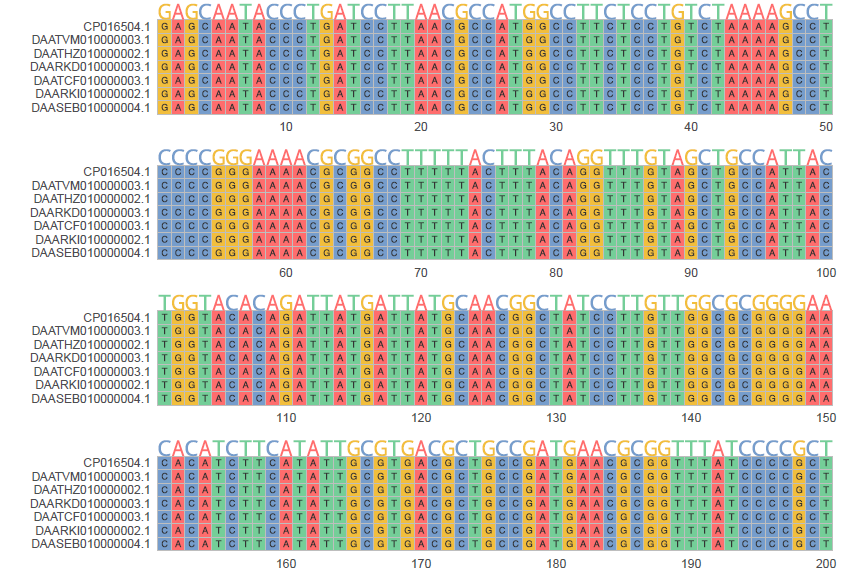
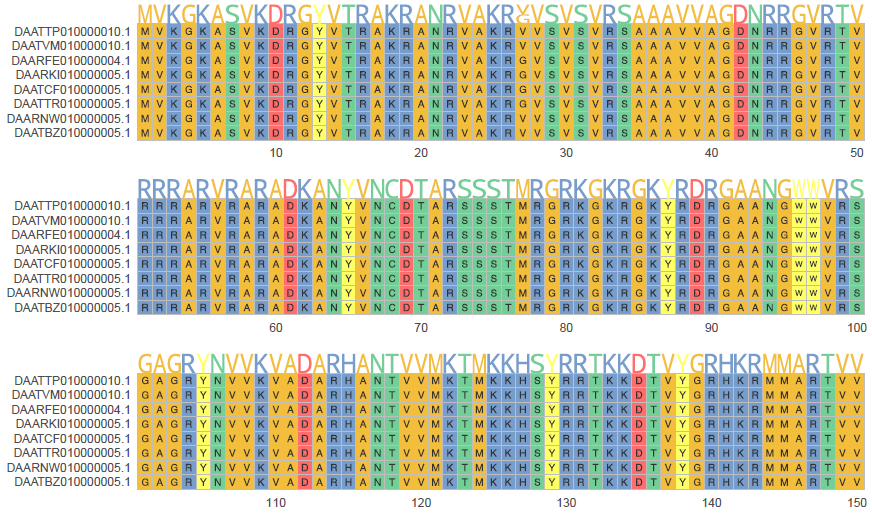

# msa-vis 

[](https://www.docker.com/)
[](https://sylabs.io/docs/)


## Introduction
`msa-vis` is developed to generate publication-grade visualizations for multiple sequence alignments (MSA).

## Getting started

The source code and required dependencies are containerized as a single image file that can be downloaded via `Docker` or `Singularity`.

#### Docker
```
docker pull jimmyliu1326/msa-vis
```
#### Singularity
```
singularity pull docker://jimmyliu1326/msa-vis
```

Once the image has been downloaded, try calling `msa-vis.R` to print the script usage message to screen.

#### Docker
```
docker run jimmyliu1326/msa-vis msa-vis.R --help
```
#### Singularity
```
singularity exec msa-vis.sif msa-vis.R --help
```

If the help message successfully prints to screen, then you are all set! :partying_face:

## Example visualizations
### DNA alignment

### Amino acid alignment


## Credit
`msa-vis` would not have been possible without the following open source packages developed by the amazing R community:

* [ggmsa](https://github.com/YuLab-SMU/ggmsa)
* [ggpubr](https://github.com/kassambara/ggpubr)
* [scales](https://github.com/r-lib/scales)
* [furrr](https://github.com/DavisVaughan/furrr)
* [Biostrings](https://github.com/Bioconductor/Biostrings)